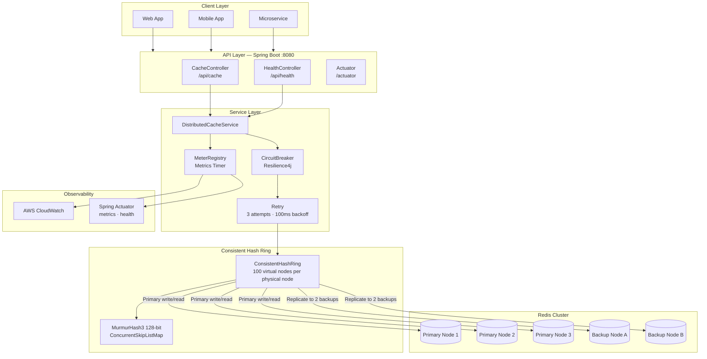
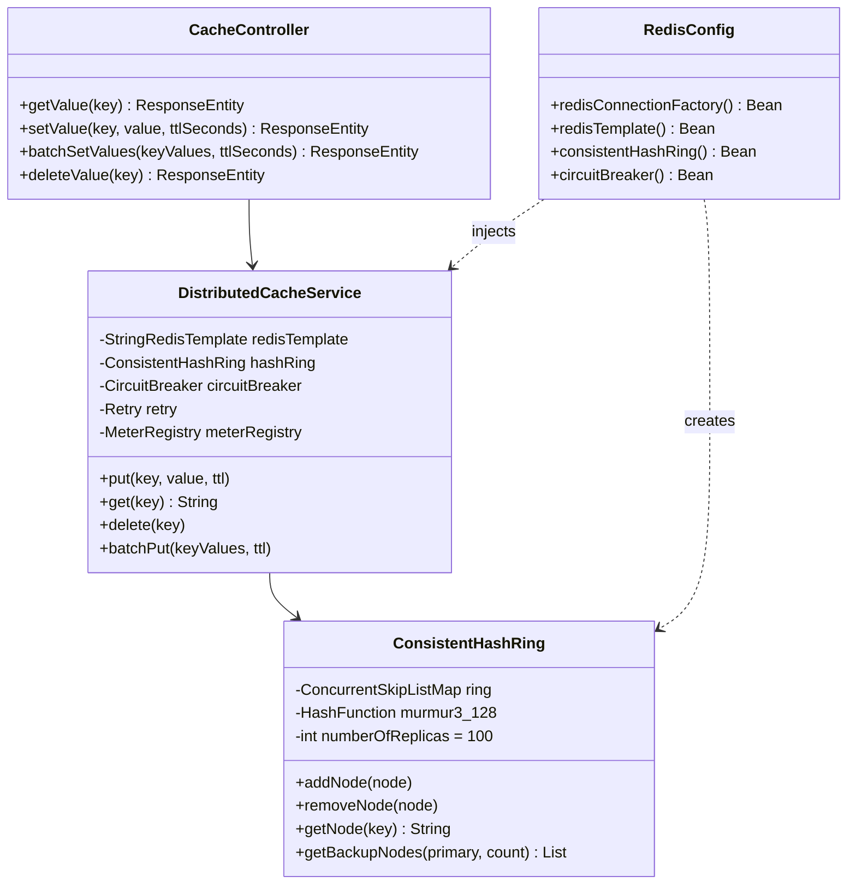
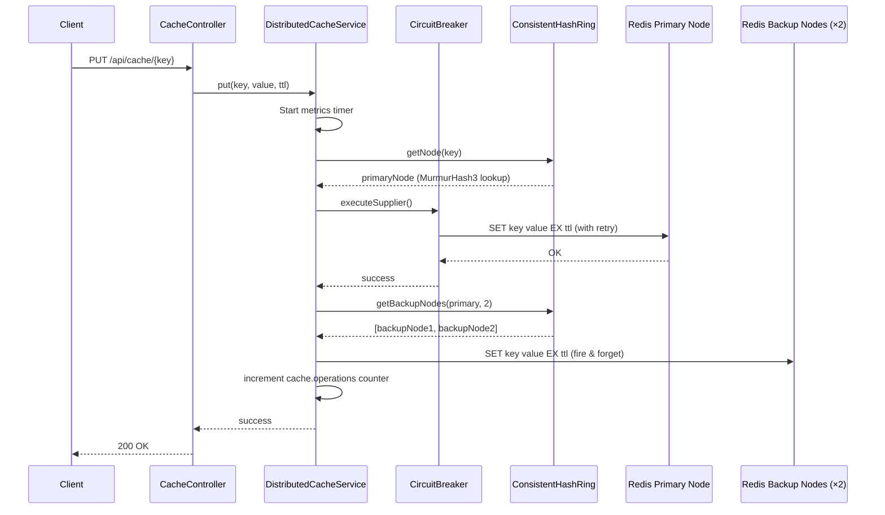
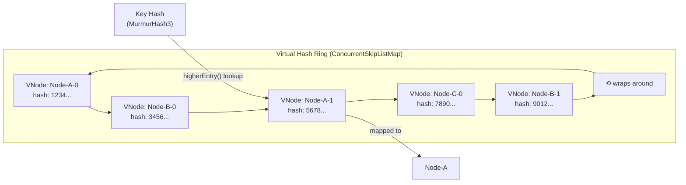
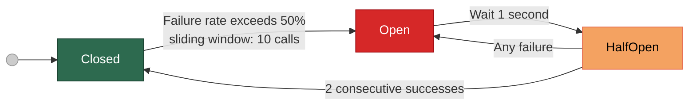
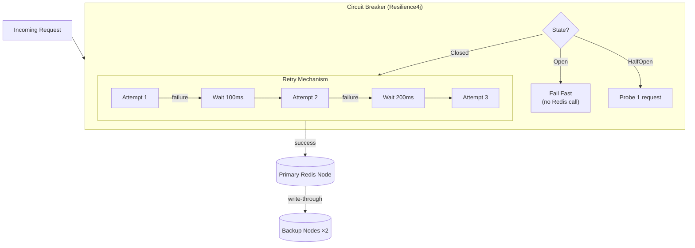

# Distributed Cache System

A high-performance distributed cache system built with **Spring Boot 3** and **Redis**, engineered for high availability, horizontal scalability, and sub-millisecond latency. Key design pillars include consistent hashing for data distribution, circuit breakers for fault tolerance, and deep observability via Spring Boot Actuator and AWS CloudWatch.

---

## 🚀 Features at a Glance

| Feature               | Details                                          |
| --------------------- | ------------------------------------------------ |
| **High Availability** | 99.9% uptime target with automatic failover      |
| **Throughput**        | 10,000+ RPS with sub-millisecond latency         |
| **Scalability**       | Horizontal scaling via consistent hashing        |
| **Fault Tolerance**   | Circuit breaker + retry with exponential backoff |
| **Replication**       | Write-through to 2 backup nodes per operation    |
| **Batch Operations**  | Redis pipelining for bulk read/write             |
| **Observability**     | Micrometer metrics → Actuator + CloudWatch       |

---

## 🏗️ System Architecture

### High-Level Overview



---

### Component Architecture



---

### Request Data Flow



---

### Consistent Hashing Deep-Dive



Each physical node gets **100 virtual nodes** placed uniformly on the ring. A key maps to the first virtual node clockwise from its own hash position. This ensures:

- **Minimal key re-mapping** when nodes are added or removed
- **Balanced load distribution** across heterogeneous nodes

---

### Circuit Breaker State Machine



---

### Fault Tolerance Stack



---

## 📁 Project Structure

```
src/main/java/com/distributed/cache/
├── DistributedCacheApplication.java   # Spring Boot entry point
├── config/
│   └── RedisConfig.java               # Redis cluster, CircuitBreaker, HashRing beans
├── controller/
│   ├── CacheController.java           # REST CRUD endpoints
│   └── HealthController.java          # Health check endpoint
├── hashing/
│   └── ConsistentHashRing.java        # MurmurHash3-based consistent hash ring
└── service/
    └── DistributedCacheService.java   # Core cache logic, metrics, replication
```

---

## 📋 Prerequisites

| Requirement | Version                              |
| ----------- | ------------------------------------ |
| Java        | 17+                                  |
| Maven       | 3.6+                                 |
| Redis       | 6+ (standalone or cluster)           |
| AWS Account | Optional (for CloudWatch monitoring) |

---

## ⚙️ Configuration

### Environment Variables

```bash
# Required: comma-separated Redis node addresses
export REDIS_CLUSTER_NODES=redis-node1:6379,redis-node2:6379,redis-node3:6379

# Optional: Redis auth password
export REDIS_PASSWORD=your_redis_password

# Optional: AWS region for CloudWatch
export AWS_REGION=us-east-1
```

### application.yml

```yaml
spring:
  redis:
    cluster:
      nodes: ${REDIS_CLUSTER_NODES:localhost:6379}
    password: ${REDIS_PASSWORD:}
    timeout: 2000
    lettuce:
      pool:
        max-active: 8
        max-idle: 8
        min-idle: 2

management:
  endpoints:
    web:
      exposure:
        include: health,metrics,prometheus
  metrics:
    export:
      cloudwatch:
        namespace: CacheService
        enabled: true
        region: ${AWS_REGION:us-east-1}
```

---

## 🛠️ Building and Running

### 1. Install Maven (macOS)

```bash
brew install maven
```

### 2. Start Redis Locally (via Docker)

```bash
# Single node (development)
docker run -d -p 6379:6379 --name redis-dev redis:7

# Or multi-node cluster (production-like)
docker-compose up -d   # if you have a docker-compose.yml with a Redis cluster
```

### 3. Build the Project

```bash
cd "Distributed Multi Cache System"

# Build and run tests
mvn clean package

# Build without running tests
mvn clean package -DskipTests
```

### 4. Run the Application

```bash
# Option A: Maven dev mode (recommended for development)
mvn spring-boot:run

# Option B: Run the packaged JAR
java -jar target/distributed-cache-system-1.0-SNAPSHOT.jar

# Option C: Override Redis config inline (no env vars needed)
java -jar target/distributed-cache-system-1.0-SNAPSHOT.jar \
  --spring.redis.cluster.nodes=localhost:6379

# Option D: Connect to a real Redis Cluster
export REDIS_CLUSTER_NODES=node1:6379,node2:6379,node3:6379
export REDIS_PASSWORD=secret
mvn spring-boot:run
```

The application starts on **`http://localhost:8080`**.

---

## 📡 API Reference

### Cache Endpoints

| Method   | Endpoint                           | Description                     |
| -------- | ---------------------------------- | ------------------------------- |
| `GET`    | `/api/cache/{key}`                 | Retrieve a cached value         |
| `POST`   | `/api/cache/{key}?ttlSeconds=3600` | Store a value with optional TTL |
| `DELETE` | `/api/cache/{key}`                 | Remove a cached value           |
| `POST`   | `/api/cache/batch?ttlSeconds=3600` | Bulk store key-value pairs      |

#### Store a Value

```bash
curl -X POST http://localhost:8080/api/cache/user:123 \
  -H "Content-Type: text/plain" \
  -d "John Doe" \
  -G --data-urlencode "ttlSeconds=3600"
```

#### Retrieve a Value

```bash
curl http://localhost:8080/api/cache/user:123
# Response: "John Doe"
```

#### Delete a Value

```bash
curl -X DELETE http://localhost:8080/api/cache/user:123
```

#### Batch Store

```bash
curl -X POST http://localhost:8080/api/cache/batch \
  -H "Content-Type: application/json" \
  -d '{"user:1": "Alice", "user:2": "Bob", "product:99": "Widget"}' \
  -G --data-urlencode "ttlSeconds=1800"
```

### Health & Monitoring Endpoints

```bash
# Application health
curl http://localhost:8080/api/health

# Spring Actuator health
curl http://localhost:8080/actuator/health

# All metrics
curl http://localhost:8080/actuator/metrics

# Specific metric
curl http://localhost:8080/actuator/metrics/cache.operation.latency
```

**Health Response:**

```json
{
  "status": "UP",
  "redis": "UP",
  "clusterNodes": ["node1:6379", "node2:6379"],
  "nodeCount": 2
}
```

---

## 📊 Metrics Reference

All metrics are exposed via Micrometer and available through Actuator and CloudWatch.

| Metric                              | Type    | Tags                  | Description                                |
| ----------------------------------- | ------- | --------------------- | ------------------------------------------ |
| `cache.operations`                  | Counter | `operation`, `status` | Total operations (put/get/delete/batchPut) |
| `cache.operation.latency`           | Timer   | —                     | Per-operation latency histogram            |
| `cache.hits`                        | Counter | —                     | Successful cache lookups                   |
| `cache.misses`                      | Counter | —                     | Failed cache lookups (key not found)       |
| `resilience4j.circuitbreaker.state` | Gauge   | —                     | 0=Closed, 1=Open, 2=HalfOpen               |
| `resilience4j.circuitbreaker.calls` | Counter | `kind`                | Success/failure call counts                |
| `redis.connection.pool.active`      | Gauge   | —                     | Active Lettuce connections                 |
| `redis.connection.pool.idle`        | Gauge   | —                     | Idle Lettuce connections                   |

---

## 🔧 Fault Tolerance Configuration

### Circuit Breaker

| Parameter                       | Value       | Description                   |
| ------------------------------- | ----------- | ----------------------------- |
| `failureRateThreshold`          | 50%         | Open threshold                |
| `waitDurationInOpenState`       | 1000ms      | Cool-down before half-open    |
| `permittedCallsInHalfOpenState` | 2           | Probe requests when half-open |
| `slidingWindowSize`             | 10          | Rolling call count window     |
| `slidingWindowType`             | COUNT_BASED | Based on call count, not time |

### Retry

| Parameter      | Value                                     |
| -------------- | ----------------------------------------- |
| `maxAttempts`  | 3                                         |
| `waitDuration` | 100ms                                     |
| Strategy       | Fixed delay (configurable to exponential) |

---

## 🧪 Testing

### Unit Tests

```bash
mvn test
```

### Integration Test (manual)

```bash
# Store a value
curl -X POST "http://localhost:8080/api/cache/test-key" \
  -H "Content-Type: text/plain" -d "hello-world"

# Retrieve it
curl http://localhost:8080/api/cache/test-key

# Confirm metrics incremented
curl http://localhost:8080/actuator/metrics/cache.operations
```

### Load Testing

```bash
# Apache Benchmark — 10,000 requests, 100 concurrent
ab -n 10000 -c 100 http://localhost:8080/api/cache/test-key

# Or with wrk
wrk -t4 -c100 -d30s http://localhost:8080/api/cache/test-key
```

---

## 🔒 Security Considerations

- Redis authentication via password (`REDIS_PASSWORD` env var)
- SSL/TLS for Redis connections (configure in `LettuceConnectionFactory`)
- IAM roles required for CloudWatch metric publishing
- Deploy within a VPC; restrict Redis ports to the application's security group
- Actuator endpoints should be secured or restricted in production (e.g., Spring Security)

---

## 🚀 Production Deployment Checklist

- [ ] Use AWS ElastiCache (cluster mode enabled) for Redis
- [ ] Set `REDIS_CLUSTER_NODES` to all cluster endpoint addresses
- [ ] Configure `REDIS_PASSWORD` with a strong auth token
- [ ] Set `AWS_REGION` and grant `CloudWatch:PutMetricData` IAM permission
- [ ] Tune Lettuce connection pool size (`max-active`) based on expected concurrency
- [ ] Enable SSL: add `useSsl(true)` to `LettuceConnectionFactory`
- [ ] Restrict `/actuator` endpoints via Spring Security
- [ ] Configure JVM heap: `-Xms512m -Xmx2g` (adjust per load)

---

## 📝 License

This project is licensed under the MIT License — see the [LICENSE](LICENSE) file for details.
